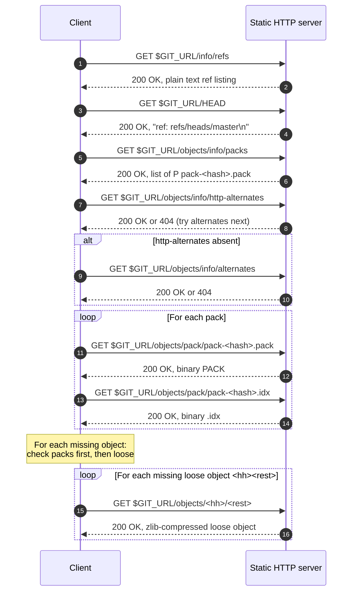
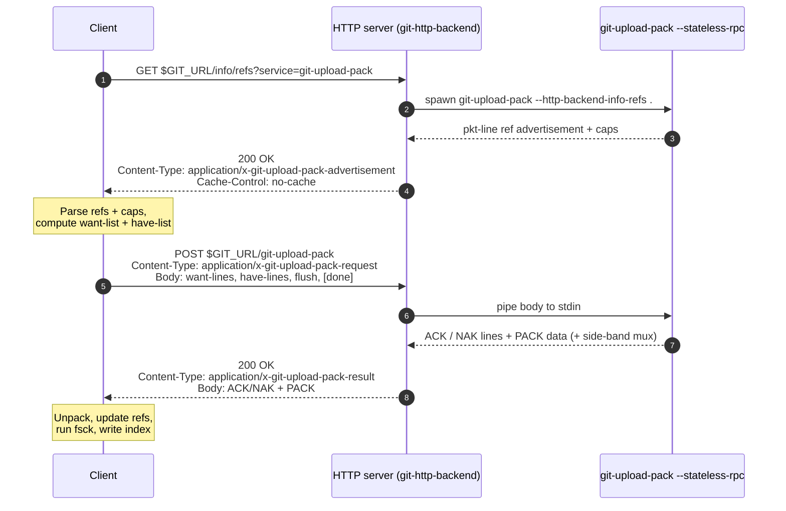
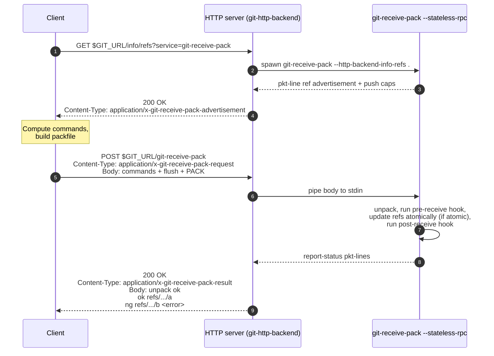
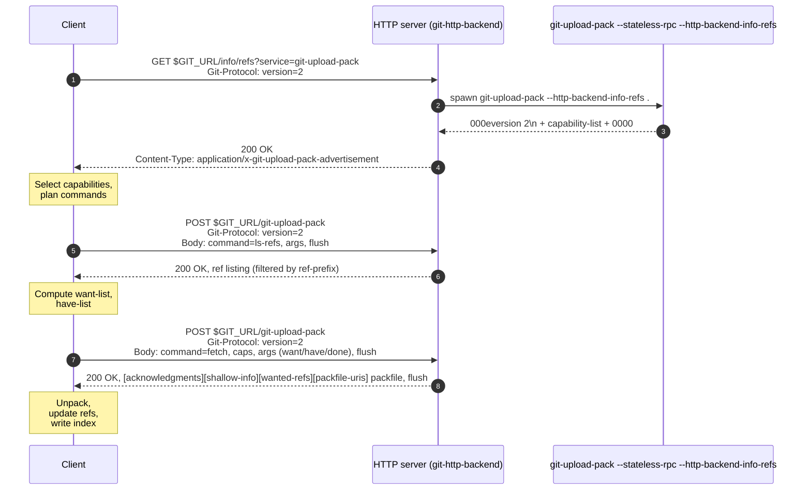

# Спецификация HTTP-протоколов Git: dumb и smart

> Сгенерировано нейросетью(GLM 5.2).

---

## Содержание

1. [Введение](#1-введение)
2. [URL-формат, аутентификация, SSL, сессии](#2-url-формат-аутентификация-ssl-сессии)
3. [Сравнительная таблица smart vs dumb](#3-сравнительная-таблица-smart-vs-dumb)
4. [Формат pkt-line](#4-формат-pkt-line)
5. [Dumb HTTP-протокол](#5-dumb-http-протокол)
6. [Smart HTTP v0/v1 — обзор](#6-smart-http-v0v1--обзор)
7. [Smart Service git-upload-pack (fetch)](#7-smart-service-git-upload-pack-fetch)
8. [Smart Service git-receive-pack (push)](#8-smart-service-git-receive-pack-push)
9. [Capabilities в v0/v1](#9-capabilities-в-v0v1)
10. [Git Protocol v2](#10-git-protocol-v2)
11. [Формат packfile](#11-формат-packfile)
12. [Формат pack-*.idx](#12-формат-pack-idx)
13. [Безопасность](#13-безопасность)
14. [Edge-cases и практические заметки](#14-edge-cases-и-практические-заметки)
15. [Приложение A: справочник HTTP-заголовков](#приложение-a-справочник-http-заголовков)
16. [Приложение B: реальные примеры HTTP-обмена](#приложение-b-реальные-примеры-http-обмена)
17. [Приложение C: сшивка с исходниками git/git](#приложение-c-сшивка-с-исходниками-gitgit)

---

## 1. Введение

Git поддерживает два HTTP-транспорта: **dumb** («тупой») и **smart** («умный»).

- **Dumb-протокол** требует только стандартный HTTP-сервер, отдающий статические файлы. Никакого CGI или специального модуля на стороне сервера не нужно — сервер просто отдаёт содержимое каталога `.git/` (или голого репозитория) как набор HTTP-ресурсов. Это исторически первый протокол; он до сих пор поддерживается как fallback.
- **Smart-протокол** требует Git-aware сервера: CGI-приложения (`git-http-backend`), серверного модуля или reverse-proxy, который умеет запускать `git-upload-pack` и `git-receive-pack`. Сервер выполняет negotiation на своей стороне и отдаёт только минимально необходимый packfile.

Дизайн-цель smart-клиента — автоматически апгрейдить dumb-URL до smart-URL: один и тот же опубликованный URL должен работать и для тупых, и для умных клиентов. Реализация этой апгрейд-логики определяется по ответу на запрос `GET $GIT_URL/info/refs?service=git-upload-pack`: если Content-Type соответствует `application/x-git-upload-pack-advertisement` — сервер smart, иначе клиенту следует интерпретировать ответ как dumb advertisement и продолжать по dumb-схеме.

### 1.1 Когда какой протокол используется

| Сценарий | Что по факту работает |
|---|---|
| `git clone https://github.com/git/git.git` на современном клиенте | Smart HTTP v2 (если сервер поддерживает), fallback на v1, fallback на dumb |
| `git clone https://example.com/repo.git` где сервер — статический nginx, отдающий `git update-server-info`-сгенерированные файлы | Только dumb HTTP |
| `git push https://...` на статическом сервере без WebDAV | **Не работает**. Push требует smart-сервера (или WebDAV для исторического dumb push, который сейчас почти нигде не поддерживается) |
| `git fetch` с partial-clone (`--filter=blob:none`) | Только smart (v1 с capability `filter` или v2 с command `fetch` + filter) |
| `git clone --depth=1` | Smart v1/v2 (capability `shallow`) или dumb (с оговорками — dumb не умеет собственно shallow, только полную историю до заданной точки) |

### 1.2 Поддержка протокольных версий

Git различает три версии wire-протокола:

- **v0** — исторический, без явного указания версии. Используется по умолчанию старыми клиентами.
- **v1** — то же, что v0, но с явной строкой `version 1` в начале advertisement, если клиент передал `version=1` как Extra Parameter.
- **v2** — command-oriented протокол, существенно переработан: capability-секция вынесена из-под NUL-байта, появился `ls-refs` вместо ref advertisement, fetch секционирован. Поверх HTTP v2 передаётся через HTTP-заголовок `Git-Protocol: version=2`.

В HTTP v0/v1 неразличимы: клиент просто не передаёт `version=`. v1 и v2 включаются одним и тем же механизмом — Extra Parameter в `Git-Protocol` header.

---

## 2. URL-формат, аутентификация, SSL, сессии

### 2.1 URL-формат

URL Git-репозитория по HTTP соответствует RFC 1738:

```
http://<host>:<port>/<path>?<searchpart>
```

В этом документе placeholder `$GIT_URL` обозначает HTTP-URL, введённый пользователем. Сервер SHOULD обрабатывать все запросы, пути которых являются продолжением `$GIT_URL`, поскольку как dumb-, так и smart-протоколы Git работают, добавляя path components в конец строки `$GIT_URL`.

**Пример dumb-запроса loose-объекта**:

```
$GIT_URL:     http://example.com:8080/git/repo.git
URL request:  http://example.com:8080/git/repo.git/objects/d0/49f6c27a2244e12041955e262a404c7faba355
```

**Пример smart-запроса к catch-all-шлюзу**:

```
$GIT_URL:     http://example.com/daemon.cgi?svc=git&q=
URL request:  http://example.com/daemon.cgi?svc=git&q=/info/refs&service=git-receive-pack
```

**Пример запроса к submodule**:

```
$GIT_URL:     http://example.com/git/repo.git/path/submodule.git
URL request:  http://example.com/git/repo.git/path/submodule.git/info/refs
```

Клиент MUST обрезать trailing `/` из `$GIT_URL`, чтобы не получать пустые path-токены (`//`) в любом URL, отправляемом на сервер. Совместимый клиент MUST раскрывать `$GIT_URL/info/refs` как `foo/info/refs`, а не `foo//info/refs`.

### 2.2 Аутентификация

Если для доступа к репозиторию требуется аутентификация, используется стандартная HTTP-аутентификация. Поскольку Git-репозитории доступны по стандартным path components, администраторы MAY использовать directory-based permissions в HTTP-сервере для контроля доступа.

- Клиент SHOULD поддерживать Basic-аутентификацию (RFC 2617).
- Сервер SHOULD полагаться на HTTP-сервер (frontend) для Basic-аутентификации.
- Сервер SHOULD NOT требовать HTTP-cookies для аутентификации или контроля доступа.
- Клиент и сервер MAY поддерживать Digest-аутентификацию и другие распространённые схемы.

### 2.3 SSL

Клиент и сервер SHOULD поддерживать SSL, особенно чтобы защитить пароли при Basic-аутентификации.

### 2.4 Session state

Git-over-HTTP stateless с точки зрения HTTP-сервера. Всё состояние MUST храниться и управляться клиентским процессом. Это позволяет простое round-robin load-balancing на стороне сервера без управления сессиями.

- Клиент MUST NOT требовать state management на сервере.
- Сервер MUST NOT требовать HTTP-cookies.
- Клиент MAY хранить и пересылать HTTP-cookies в процессе запроса (RFC 2616). Сервер SHOULD игнорировать любые cookies от клиента.

### 2.5 Общая обработка запросов

За исключением особо оговоренных случаев, всё стандартное HTTP-поведение SHOULD предполагаться обеими сторонами:

- Если репозитория по `$GIT_URL` нет, сервер MUST NOT отвечать `200 OK`. SHOULD — `404 Not Found`, `410 Gone` или любой подходящий код, не подразумевающий существование ресурса.
- Если репозиторий есть, но доступ не разрешён, сервер MUST ответить `403 Forbidden`.
- Сервер SHOULD поддерживать HTTP/1.0 и HTTP/1.1.
- Сервер SHOULD поддерживать chunked encoding для request и response bodies.
- Клиент SHOULD поддерживать HTTP/1.0 и HTTP/1.1, chunked encoding.
- Сервер MAY возвращать `ETag` и/или `Last-Modified`.
- Клиент MAY revalidate cache через `If-Modified-Since` и/или `If-None-Match`.
- Сервер MAY вернуть `304 Not Modified` — клиент MUST трактовать это идентично `200 OK`, используя кэшированную сущность.

---

## 3. Сравнительная таблица smart vs dumb

| Критерий | Dumb HTTP | Smart HTTP v0/v1 | Smart HTTP v2 |
|---|---|---|---|
| Discovery-запрос | `GET $GIT_URL/info/refs` (без параметров) | `GET $GIT_URL/info/refs?service=git-upload-pack` | `GET $GIT_URL/info/refs?service=git-upload-pack` + header `Git-Protocol: version=2` |
| Content-Type ответа discovery | `text/plain; charset=utf-8` (или любой, но не `application/x-git-*`) | `application/x-git-$service-advertisement` | `application/x-git-$service-advertisement` (первая pkt-line `version 2`) |
| Тело discovery | Plain text: `<oid>\t<refname>\n` | pkt-line-stream: `# service=...\n`, flush, ref-list с caps за NUL на первой ссылке, flush | pkt-line-stream: `version 2`, capability-list, flush |
| Fetch-эндпоинт | `GET $GIT_URL/objects/<hh>/<rest>` (loose), `GET $GIT_URL/objects/pack/pack-<hash>.pack` | `POST $GIT_URL/git-upload-pack` (Content-Type `application/x-git-upload-pack-request`) | `POST $GIT_URL/git-upload-pack` (тот же URL, но тело — v2 команды) |
| Push-эндпоинт | WebDAV: `MKCOL`, `PUT`, `DELETE`, `LOCK`, `UNLOCK`, `PROPFIND` | `POST $GIT_URL/git-receive-pack` | `POST $GIT_URL/git-receive-pack` (v2 не специфицирует receive-pack отдельно — server-side v2 для push в upstream git не реализовано; используется v1 поверх того же URL) |
| Negotiation | Нет — клиент скачивает все packfiles и все loose objects по мере надобности | `want`/`have` rounds с `ACK`/`NAK` (multi_ack, multi_ack_detailed, no-done) | `fetch` command с секциями `acknowledgments`, `shallow-info`, `wanted-refs`, `packfile-uris`, `packfile` |
| Packfile generation | Сервер не генерирует packfile под клиента — отдаются те pack-файлы, что уже лежат в `.git/objects/pack/` | Сервер генерирует packfile под want/have клиента (через `git pack-objects`) | То же, что v1, но в секционированном ответе |
| Side-band | Нет | Опционально (`side-band` или `side-band-64k` capability) — multiplexing pack/progress/error | По умолчанию multiplexing в `packfile`-секции (как side-band-64k); опционально `sideband-all` для всего ответа |
| Caching | `Cache-Control: no-cache` на info/refs и info/packs; packfiles и loose objects кэшируются навсегда (immutable) | `Cache-Control: no-cache, max-age=0, must-revalidate` на всё | То же |
| Stateless | Да (по определению) | Да — `--stateless-rpc` флаг; каждый POST самодостаточен | Да — плюс `0002` response-end-pkt для явного завершения ответа |
| Shallow clone | Не поддерживается нативно (только полная история до shallow-boundary) | Capability `shallow`, `deepen`, `deepen-since`, `deepen-not`, `deepen-relative` | То же, но через секцию `shallow-info` в ответе `fetch` |
| Partial clone | Невозможно | Capability `filter` | `filter` feature команды `fetch` |
| Object format (SHA-256) | Поддерживается, но путь объектов становится `objects/[0-9a-f]{2}/[0-9a-f]{62}` | Capability `object-format=sha256` | Capability `object-format=sha256` |
| Возможность push без server-side Git | Только WebDAV (исторический dumb push, почти нигде не поддерживается) | Нет | Нет |
| Сложность сервера | Минимальная (любой статический HTTP-сервер) | CGI/mod: `git-http-backend` | CGI/mod: `git-http-backend` + `protocol.version=v2` в конфиге |

---

## 4. Формат pkt-line

Подавляющее большинство payload в Git wire-протоколах обёрнуто в pkt-line. Спецификация — `Documentation/gitprotocol-common.adoc`.

### 4.1 Определение

pkt-line — это binary string переменной длины. Первые 4 байта строки (`pkt-len`) задают общую длину строки в hex. pkt-len **включает** 4 байта самой hex-записи длины.

pkt-line MAY содержать бинарные данные, поэтому реализации MUST обеспечить 8-bit clean парсинг/сериализацию.

- Небинарная строка SHOULD завершаться LF, и если LF присутствует, он MUST быть включён в общую длину.
- Приёмник MUST трактовать pkt-line без бинарных данных одинаково — с trailing-LF или без него (stripping LF, если есть; не жалуясь, если его нет).
- Максимальная длина data-компонента pkt-line — **65516 байт**.
- Реализациям MUST NOT отправлять pkt-line длиной более **65520** (65516 payload + 4 длины).
- Реализациям SHOULD NOT отправлять пустой pkt-line (`0004`).
- pkt-line с длиной 0 (`0000`) — специальный случай, **flush-pkt**, обрабатывается иначе, чем пустой pkt-line (`0004`).

### 4.2 ABNF

```
pkt-line     =  data-pkt / flush-pkt

data-pkt     =  pkt-len pkt-payload
pkt-len      =  4*(HEXDIG)
pkt-payload  =  (pkt-len - 4)*(OCTET)

flush-pkt    = "0000"
```

Дополнительно в protocol v2 добавляются:
- `delim-pkt` = `0001` — разделяет секции одного сообщения.
- `response-end-pkt` = `0002` — завершает ответ для stateless-соединений.

### 4.3 Примеры (как C-strings)

| pkt-line | actual value |
|---|---|
| `0006a\n` | `a\n` |
| `0005a` | `a` |
| `000bfoobar\n` | `foobar\n` |
| `0004` | `""` (пустой — SHOULD NOT отправлять) |
| `0000` | flush-pkt |
| `0001` | delim-pkt (v2 only) |
| `0002` | response-end-pkt (v2 only) |

### 4.4 Байтовая диаграмма

```
 0                   1                   2                   3
 0 1 2 3 4 5 6 7 8 9 0 1 2 3 4 5 6 7 8 9 0 1 2 3 4 5 6 7 8 9 0 1
+-+-+-+-+-+-+-+-+-+-+-+-+-+-+-+-+-+-+-+-+-+-+-+-+-+-+-+-+-+-+-+-+
|     pkt-len (4 ASCII hex digits, length includes these 4B)     |
+-+-+-+-+-+-+-+-+-+-+-+-+-+-+-+-+-+-+-+-+-+-+-+-+-+-+-+-+-+-+-+-+
|                                                               |
.                                                               .
.                  payload (binary, 0..65516 bytes)              .
.                                                               .
|                                                               |
+-+-+-+-+-+-+-+-+-+-+-+-+-+-+-+-+-+-+-+-+-+-+-+-+-+-+-+-+-+-+-+-+
```

Литеры pkt-len используют **строчные hex** (`0-9a-f`). Реализация `set_packet_header()` в `pkt-line.c`:

```c
static char hexchar[] = "0123456789abcdef";
#define hex(a) (hexchar[(a) & 15])
buf[0] = hex(size >> 12);
buf[1] = hex(size >> 8);
buf[2] = hex(size >> 4);
buf[3] = hex(size);
```

### 4.5 Специальные маркеры

| Маркер | Имя | Где | Семантика |
|---|---|---|---|
| `0000` | flush-pkt | v0/v1/v2 | Завершение сообщения / секции; для клиента это сигнал «больше данных в этом блоке не будет» |
| `0001` | delim-pkt | только v2 | Разделение секций внутри одного ответа (например, между `acknowledgments` и `packfile`) |
| `0002` | response-end-pkt | v2 over stateless (HTTP) | Подзывает конец ответа для stateless-соединений; специфичен для HTTP-транспорта v2 |
| `0004` | empty pkt-line | нигде не нормален | Реализациям SHOULD NOT отправлять; приёмник трактует как пустой payload |

### 4.6 error-line

В любом месте, где ожидается `PKT-LINE(...)`, MAY быть отправлен error-pkt:

```
error-line = PKT-LINE("ERR" SP explanation-text)
```

После отправки error-pkt процесс передачи данных прекращается.

---

## 5. Dumb HTTP-протокол

Dumb-протокол требует только стандартный HTTP-сервер. Сервер выступает как файловый архив Git-репозитория: клиент сам обходит `info/refs`, скачивает packfiles из `objects/pack/`, и достаёт loose-объекты из `objects/<hh>/<rest>`.

### 5.1 Эндпоинты dumb-сервера

Таблица ниже — сводка всех URL, которые dumb-клиент будет запрашивать. Эндпоинты взяты из dispatch-таблицы `services[]` в `http-backend.c` (строки 727–746), которая одновременно обслуживает dumb- и smart-запросы. Для статического сервера (без `git-http-backend`) администратор должен настроить раздачу соответствующих путей.

| Метод | URL относительно `$GIT_URL` | Content-Type | Назначение |
|---|---|---|---|
| GET | `/HEAD` | `text/plain` | Содержимое `HEAD` (`ref: refs/heads/master\n` или `<oid>\n`) |
| GET | `/info/refs` | `text/plain; charset=utf-8` | Листинг ссылок в формате `<oid>\t<refname>\n` |
| GET | `/objects/info/alternates` | `text/plain` | Локальные альтернативные object stores |
| GET | `/objects/info/http-alternates` | `text/plain` | HTTP-URL альтернативных object stores |
| GET | `/objects/info/packs` | `text/plain; charset=utf-8` | Листинг packfiles (`P pack-<hash>.pack\n`) |
| GET | `/objects/[0-9a-f]{2}/[0-9a-f]{38}` | `application/x-git-loose-object` | Loose-объект SHA-1 (zlib-сжатый) |
| GET | `/objects/[0-9a-f]{2}/[0-9a-f]{62}` | `application/x-git-loose-object` | Loose-объект SHA-256 |
| GET | `/objects/pack/pack-[0-9a-f]{40}.pack` | `application/x-git-packed-objects` | Packfile SHA-1 |
| GET | `/objects/pack/pack-[0-9a-f]{64}.pack` | `application/x-git-packed-objects` | Packfile SHA-256 |
| GET | `/objects/pack/pack-[0-9a-f]{40}.idx` | `application/x-git-packed-objects-toc` | Pack-индекс SHA-1 |
| GET | `/objects/pack/pack-[0-9a-f]{64}.idx` | `application/x-git-packed-objects-toc` | Pack-индекс SHA-256 |

**Dumb-сервер MUST NOT** возвращать Content-Type, начинающийся с `application/x-git-` — это сигнализировало бы о smart-сервере. Для dumb-ответа на `info/refs` Content-Type MUST быть `text/plain` (или любым, не начинающимся с `application/x-git-`).

### 5.2 Discovery references (dumb)

Все HTTP-клиенты (включая dumb) MUST начинать fetch или push с discovery references — запроса к `info/refs`.

Dumb-клиент делает `GET` запрос к `$GIT_URL/info/refs` **без** query-параметров:

```
C: GET $GIT_URL/info/refs HTTP/1.0

S: 200 OK
S:
S: 95dcfa3633004da0049d3d0fa03f80589cbcaf31  refs/heads/maint
S: d049f6c27a2244e12041955e262a404c7faba355  refs/heads/master
S: 2cb58b79488a98d2721cea644875a8dd0026b115  refs/tags/v1.0
S: a3c2e2402b99163d1d59756e5f207ae21cccba4c  refs/tags/v1.0^{}
```

Требования:

- Content-Type ответа SHOULD быть `text/plain; charset=utf-8`, но MAY быть любым. Клиент MUST NOT валидировать Content-Type.
- Dumb-сервер MUST NOT возвращать Content-Type, начинающийся с `application/x-git-`.
- Cache-Control MAY отключать кэширование.
- Клиент SHOULD проверить только HTTP status code: `200 OK` или `304 Not Modified`.
- Тело — UNIX-text-file: каждая строка описывает ref и его значение.
- Файл SHOULD быть отсортирован по имени в C locale ordering.
- Файл SHOULD NOT включать default ref `HEAD` (он отдельно отдаётся через `/HEAD`).

ABNF формата `info/refs` (dumb):

```
info_refs   =  *( ref_record )
ref_record  =  any_ref / peeled_ref

any_ref     =  obj-id HTAB refname LF
peeled_ref  =  obj-id HTAB refname LF
               obj-id HTAB refname "^{}" LF
```

`peeled_ref` — для annotated tags: после строки с ref-имя следует строка с тем же ref-именем + `^{}`, указывающая на коммит, на который в итоге указывает tag. Реализация dumb-сервера: `git update-server-info` генерирует этот файл, вызывая `show_text_ref` в `http-backend.c` (строки 521–538).

### 5.3 Discovery HEAD (dumb)

Дополнительно клиент может запросить `$GIT_URL/HEAD` — это даёт указатель на ветку по умолчанию:

```
C: GET $GIT_URL/HEAD HTTP/1.0

S: 200 OK
S: Content-Type: text/plain
S:
S: ref: refs/heads/master
```

Или для голого репозитория без HEAD, указанного как symref:

```
S: 95dcfa3633004da0049d3d0fa03f80589cbcaf31
```

Реализация `show_head_ref` в `http-backend.c` (строки 580–597).

### 5.4 Discovery packs

`$GIT_URL/objects/info/packs` — листинг доступных packfiles:

```
C: GET $GIT_URL/objects/info/packs HTTP/1.0

S: 200 OK
S: Content-Type: text/plain; charset=utf-8
S:
S: P pack-95dcfa3633004da0049d3d0fa03f80589cbcaf31.pack
S: P pack-d049f6c27a2244e12041955e262a404c7faba355.pack
S:
```

Формат: одна строка `P <filename>` на каждый pack, завершается пустой строкой. Реализация `get_info_packs` в `http-backend.c` (строки 610–633).

Клиент использует этот листинг, чтобы понять, какие packfiles скачивать целиком. Packfiles скачиваются в первую очередь, чтобы минимизировать число запросов на loose-objects (каждый loose-объект — отдельный HTTP-запрос).

### 5.5 Alternates

Если `$GIT_URL/objects/info/alternates` или `$GIT_URL/objects/info/http-alternates` существует, dumb-клиент будет читать из указанных там альтернативных object stores. Это позволяет репозиторию «заимствовать» объекты из соседнего репозитория.

- `/objects/info/alternates` — относительные пути на том же сервере (используются и для filesystem-альтернатив).
- `/objects/info/http-alternates` — абсолютные или относительные HTTP-URL на другие репозитории. Этот файл специфичен для HTTP: dumb-клиент сначала пытается `http-alternates`, и при неудаче — `alternates`.

Реализация: `fetch_alternates` в `http-walker.c` (строка 344) запрашивает `http-alternates`; если вернулся неуспешный ответ, fallback на `alternates`.

Формат обоих файлов — по одному пути/URL на строку. Для `http-alternates` URL может быть как абсолютным, так и относительным к `objects/`-каталогу текущего репозитория.

### 5.6 Скачивание loose-объекта

Когда клиенту нужен объект, которого нет ни в одном packfile, он скачивает loose-объект:

```
$GIT_URL/objects/<first-2-hex-of-oid>/<remaining-38-hex-of-oid>
```

Например, для SHA-1 `d049f6c27a2244e12041955e262a404c7faba355`:

```
C: GET $GIT_URL/objects/d0/49f6c27a2244e12041955e262a404c7faba355 HTTP/1.0

S: 200 OK
S: Content-Type: application/x-git-loose-object
S: Cache-Control: public, max-age=31536000
S: Last-Modified: Wed, 19 Sep 2026 12:00:00 GMT
S:
S: <zlib-compressed loose object bytes>
```

Loose-объект — это zlib-сжатый blob/tree/commit/tag в формате, описанном в `gitformat-loose(5)`. Контент является immutable — сервер SHOULD кэшировать его навсегда (`Cache-Control: public, max-age=31536000`). Реализация `get_loose_object` в `http-backend.c` (строки 228–233) и `hdr_cache_forever` (строки 122–128).

Для SHA-256 длина hex-части OID — 64 символа, поэтому path принимает форму `objects/[0-9a-f]{2}/[0-9a-f]{62}`.

### 5.7 Скачивание packfile

Когда dumb-клиент видит в `info/packs` packfile, в котором могут быть нужные объекты, он скачивает и pack, и соответствующий `.idx`:

```
C: GET $GIT_URL/objects/pack/pack-95dcfa3633004da0049d3d0fa03f80589cbcaf31.pack HTTP/1.0

S: 200 OK
S: Content-Type: application/x-git-packed-objects
S: Cache-Control: public, max-age=31536000
S: Content-Length: 1234567
S:
S: <binary PACK data>
```

```
C: GET $GIT_URL/objects/pack/pack-95dcfa3633004da0049d3d0fa03f80589cbcaf31.idx HTTP/1.0

S: 200 OK
S: Content-Type: application/x-git-packed-objects-toc
S: Cache-Control: public, max-age=31536000
S:
S: <binary .idx data>
```

Реализация `get_pack_file` / `get_idx_file` в `http-backend.c` (строки 235–247). Контент immutable, кэшируется навсегда.

### 5.8 Sequence-диаграмма: dumb fetch



### 5.9 Dumb push через WebDAV

Исторически dumb push осуществлялся через WebDAV (RFC 4918). Современные клиенты используют smart push; dumb push остаётся в `http-push.c` для совместимости, но требует, чтобы HTTP-сервер поддерживал WebDAV-методы `MKCOL`, `PUT`, `DELETE`, `LOCK`, `UNLOCK`, `PROPFIND`.

Сводка WebDAV-операций dumb push:

| Метод | Путь | Назначение |
|---|---|---|
| `PROPFIND` | `$GIT_URL/objects/pack/` | Получить список существующих packfiles (для negotiation) |
| `LOCK` | `$GIT_URL/objects/pack/` или конкретный pack | Захватить эксклюзивную блокировку на время push |
| `MKCOL` | `$GIT_URL/objects/pack/` (если не существует) | Создать каталог pack |
| `PUT` | `$GIT_URL/objects/pack/pack-<hash>.pack`, `$GIT_URL/objects/pack/pack-<hash>.idx` | Загрузить новый packfile и его индекс |
| `PUT` | `$GIT_URL/objects/<hh>/<rest>` | Загрузить loose-объект (если используется loose-only push) |
| `PUT` | `$GIT_URL/info/refs` | Обновить листинг refs |
| `DELETE` | Старые объекты | Очистка (редко) |
| `UNLOCK` | Lock token | Освободить блокировку |

Поскольку WebDAV-сервер для Git-репозитория требует тонкой настройки и сегодня почти не используется, более подробно dumb push рассматривается в исходнике `http-push.c` (2012 строк), но в данной спецификации он приводится только для полноты картины. **Современные серверы не поддерживают dumb push**.

---

## 6. Smart HTTP v0/v1 — обзор

Smart-протокол требует Git-aware сервера: CGI-приложения `git-http-backend` (входит в комплект Git) или серверного модуля, запускающего `git-upload-pack` и `git-receive-pack`.

### 6.1 Два сервиса

Smart-сервер поддерживает два RPC-сервиса:

| Сервис | Назначение | URL | Серверный процесс |
|---|---|---|---|
| `git-upload-pack` | Fetch (clone, fetch, pull) | `POST $GIT_URL/git-upload-pack` | `git-upload-pack --stateless-rpc .` |
| `git-receive-pack` | Push | `POST $GIT_URL/git-receive-pack` | `git-receive-pack --stateless-rpc .` |

Дополнительно: `POST $GIT_URL/git-upload-archive` — для `git archive --remote` (специфика архивации, в данной спецификации не рассматривается подробно).

### 6.2 Discovery: smart info/refs

Smart-клиент начинает с параметризованного запроса к `info/refs`:

```
C: GET $GIT_URL/info/refs?service=git-upload-pack HTTP/1.0
```

Параметр `service` MUST быть один, без других query-параметров. Имя сервиса — `git-upload-pack` или `git-receive-pack`.

**Dumb-сервер** ответит plain-text листингом (см. §5.2). Это запускает fallback-логику на клиенте.

**Smart-сервер** ответит pkt-line-потоком с Content-Type `application/x-git-upload-pack-advertisement`:

```
S: 200 OK
S: Content-Type: application/x-git-upload-pack-advertisement
S: Cache-Control: no-cache
S:
S: 001e# service=git-upload-pack\n
S: 0000
S: 004895dcfa3633004da0049d3d0fa03f80589cbcaf31 refs/heads/maint\0multi_ack\n
S: 003fd049f6c27a2244e12041955e262a404c7faba355 refs/heads/master\n
S: 003c2cb58b79488a98d2721cea644875a8dd0026b115 refs/tags/v1.0\n
S: 003fa3c2e2402b99163d1d59756e5f207ae21cccba4c refs/tags/v1.0^{}\n
S: 0000
```

Реализация: `get_info_refs` в `http-backend.c` (строки 540–578) — отправляет `# service=...` + flush, затем запускает `git-upload-pack --http-backend-info-refs .`, чей stdout и есть остальной pkt-line-поток.

### 6.3 Формат smart-ответа info/refs (v0/v1)

```
smart_reply     =  PKT-LINE("# service=$servicename" LF)
                   "0000"
                   *1("version 1")
                   ref_list
                   "0000"
ref_list        =  empty_list / non_empty_list

empty_list      =  PKT-LINE(zero-id SP "capabilities^{}" NUL cap-list LF)

non_empty_list  =  PKT-LINE(obj-id SP name NUL cap_list LF)
                   *ref_record

cap-list        =  capability *(SP capability)
capability      =  1*(LC_ALPHA / DIGIT / "-" / "_")
LC_ALPHA        =  %x61-7A

ref_record      =  any_ref / peeled_ref
any_ref         =  PKT-LINE(obj-id SP name LF)
peeled_ref      =  PKT-LINE(obj-id SP name LF)
                   PKT-LINE(obj-id SP name "^{}" LF)
```

Где:

- `obj-id` — hex-строка OID (40 символов для SHA-1, 64 для SHA-256).
- `name` — refname (см. §4.2 gitprotocol-common: иерархический octet-string, начинается с `refs/` или `HEAD`).
- `NUL` — байт `0x00`.
- `LF` — байт `0x0A`.
- `SP` — пробел `0x20`.
- `HTAB` — таб `0x09`.
- `zero-id` — 40 нулей (или 64 для SHA-256) — обозначает «несуществующий» obj-id (используется в delete-командах push и в `capabilities^{}` для пустого репозитория).

### 6.4 Клиентские проверки

- Клиент MUST валидировать, что status code — `200 OK` или `304 Not Modified`.
- Клиент MUST валидировать, что первые 5 байт ответа соответствуют regex `^[0-9a-f]{4}#`. Если валидация провалена, клиент MUST NOT продолжать.
- Клиент MUST парсить весь ответ как последовательность pkt-line.
- Клиент MUST проверить, что первая pkt-line — `# service=$servicename`. Сервер MUST установить $servicename в значение request parameter.
- Сервер SHOULD включать LF в конце этой строки. Клиент MUST игнорировать trailing LF.
- Сервер MUST завершать ответ magic-маркером `0000` (flush-pkt).

Если Content-Type не `application/x-$servicename-advertisement`, клиент SHOULD fallback на dumb-протокол, **не** делая дополнительный запрос к `info/refs`, а используя уже полученный ответ. Если клиент не поддерживает dumb, он MUST abort.

### 6.5 Extra Parameters (HTTP)

Клиент MAY передавать Extra Parameters (см. `gitprotocol-pack(5)`) через HTTP-заголовок `Git-Protocol`:

```
C: GET $GIT_URL/info/refs?service=git-upload-pack HTTP/1.0
C: Git-Protocol: version=1
```

Или для нескольких параметров, разделённых двоеточием:

```
C: Git-Protocol: version=1:session-id=abc123
```

Сервер читает этот заголовок и прокидывает его в переменную окружения `GIT_PROTOCOL` процесса `git-upload-pack` / `git-receive-pack`.

В v0 Extra Parameters не передаются (поведение по умолчанию). В v1 — `version=1`. В v2 — `version=2` (см. §10).

---

## 7. Smart Service git-upload-pack (fetch)

`git-upload-pack` — серверный процесс, выполняющий fetch (clone/fetch/pull).

### 7.1 HTTP-запрос

После discovery клиент делает POST-запрос к `$GIT_URL/git-upload-pack`:

```
C: POST $GIT_URL/git-upload-pack HTTP/1.0
C: Content-Type: application/x-git-upload-pack-request
C: Cache-Control: no-cache
C:
C: <pkt-line stream>
```

Реализация: `service_rpc` в `http-backend.c` (строки 654–680). Сервер валидирует Content-Type, передаёт тело запроса в stdin `git-upload-pack --stateless-rpc .`, а stdout процесса — клиенту с Content-Type `application/x-git-upload-pack-result`.

Поддерживается gzip-кодирование request body: клиент MAY отправить `Content-Encoding: gzip`, сервер разжимает и передаёт в upload-pack. Реализация — `inflate_request` в `http-backend.c` (строки 384–445).

### 7.2 Тело запроса (upload-request)

```
compute_request   =  want_list
                     have_list
                     request_end
request_end       =  "0000" / "done"

want_list         =  PKT-LINE(want SP cap_list LF)
                     *(want_pkt)
want_pkt          =  PKT-LINE(want LF)
want              =  "want" SP id
cap_list          =  capability *(SP capability)

have_list         =  *PKT-LINE("have" SP id LF)
```

Полная форма (из `gitprotocol-pack(5)`, см. `gitprotocol-pack.adoc` строки 258–280):

```
upload-request    =  want-list
                     *shallow-line
                     *1depth-request
                     [filter-request]
                     flush-pkt

want-list         =  first-want
                     *additional-want

shallow-line      =  PKT-LINE("shallow" SP obj-id)

depth-request     =  PKT-LINE("deepen" SP depth) /
                     PKT-LINE("deepen-since" SP timestamp) /
                     PKT-LINE("deepen-not" SP ref)

first-want        =  PKT-LINE("want" SP obj-id SP capability-list)
additional-want   =  PKT-LINE("want" SP obj-id)

depth             =  1*DIGIT

filter-request    =  PKT-LINE("filter" SP filter-spec)
```

Пример простого clone (без have):

```
C: 0054want 74730d410fcb6603ace96f1dc55ea6196122532d multi_ack side-band-64k ofs-delta\n
C: 0032want 7d1665144a3a975c05f1f43902ddaf084e784dbe\n
C: 0032want 5a3f6be755bbb7deae50065988cbfa1ffa9ab68a\n
C: 0032want 7e47fe2bd8d01d481f44d7af0531bd93d3b21c01\n
C: 0032want 74730d410fcb6603ace96f1dc55ea6196122532d\n
C: 0000
C: 0009done\n
```

Пример инкрементального fetch (с have):

```
C: 0054want 74730d410fcb6603ace96f1dc55ea6196122532d multi_ack side-band-64k ofs-delta\n
C: 0032want 7d1665144a3a975c05f1f43902ddaf084e784dbe\n
C: 0032want 5a3f6be755bbb7deae50065988cbfa1ffa9ab68a\n
C: 0000
C: 0032have 7e47fe2bd8d01d481f44d7af0531bd93d3b21c01\n
C: [30 more have lines]
C: 0032have 74730d410fcb6603ace96f1dc55ea6196122532d\n
C: 0000
```

### 7.3 Правила want-линий

- Клиент MUST отправить **минимум одну** `want` команду.
- Клиент MUST NOT ссылаться на obj-id, не появившийся в ref discovery, ЕСЛИ сервер не анонсировал capability `allow-tip-sha1-in-want` или `allow-reachable-sha1-in-want`.
- Первая `want`-строка несёт capability-list, отделённый пробелом от OID.
- Дополнительные `want`-строки — только `want` + пробел + OID.
- Все OID должны быть в нижнем регистре hex; сервер и клиент обрабатывают OID case-insensitive.

### 7.4 Правила have-линий

- `have` отправляется пачками по 32 (канонический клиент) с последующим flush-pkt между пачками в `multi_ack`-режиме.
- После 256 `have` без единого ACK от сервера клиент SHOULD отправить `done`, чтобы заставить сервер начать вычисление packfile (даже без общей базы — сервер просто отправит все объекты).
- Если клиент получил хотя бы один `ACK <oid> continue` ранее, лимит 256 срабатывает; иначе клиент продолжит ждать.

### 7.5 Negotiation-алгоритм

Алгоритм минимизации packfile (см. `gitprotocol-http.adoc` строки 368–480 и `gitprotocol-pack.adoc` строки 243–461):

**Init step (клиент):**
1. Ref discovery → получить advertised refs.
2. Все увиденные объекты поместить в set `advertised`.
3. Создать пустой set `common` — общие объекты (есть у обеих сторон).
4. Создать set `want` — объекты из `advertised`, которые клиент хочет.
5. Создать queue `c_pending`, упорядоченный по commit-time (newest first). Добавить все клиентские refs. При pop-е commit его parents добавляются автоматически. Commit может войти в queue только один раз.

**One compute step:**

Клиент отправляет:

```
C: 0032want <want-#1>...
C: 0032want <want-#2>...
C: 0032have <common-#1>...
C: 0032have <have-#1>...
C: 0000
```

Команды в потоке появляются в порядке: `want`, затем `have`. Команды завершаются flush-pkt.

Сервер парсит запрос:

1. Валидирует, что все `want`-объекты достижимы из refs (или что есть `allow-reachable-sha1-in-want`).
2. Создаёт пустой list `s_common`.
3. Для каждого `have`-объекта, если он достижим из ref на сервере, добавляет в `s_common`. Если commit добавлен в `s_common`, его ancestors НЕ добавляются (даже если они тоже в `have`).

**Ответ сервера** зависит от ack-mode (см. ниже).

Клиент парсит ответ и решает, нужен ли ещё один compute step.

### 7.6 Режимы ACK

#### 7.6.1 Без `multi_ack` и без `multi_ack_detailed`

- Сервер отправляет `ACK <obj-id>` на первый найденный common-объект.
- После ACK сервер молчит до тех пор, пока клиент не пришлёт `done`.
- Сервер отправляет `NAK` на flush-pkt, если common-объектов пока не найдено.
- Если уже отправлен ACK, сервер молчит на flush-pkt.

#### 7.6.2 `multi_ack`

- Сервер отправляет `ACK <obj-id> continue` как только находит общий commit между want-клиента и have-клиента.
- Это позволяет клиенту перестать идти по этой ветке истории.
- После того как сервер нашёл «acceptable common base commit» и готов сгенерировать packfile, он начинает ACKать все `have`-объекты слепо.
- Сервер отправляет `NAK` и ждёт следующего ответа клиента (либо `done`, либо новую пачку `have`).

#### 7.6.3 `multi_ack_detailed`

То же, что `multi_ack`, но сервер различает:
- `ACK <obj-id> common` — найден общий коммит.
- `ACK <obj-id> ready` — сервер готов отправлять packfile.

#### 7.6.4 `no-done`

Только для smart HTTP. Если включены `multi_ack_detailed` и `no-done`, сервер может отправить pack сразу после первого `ACK <obj-id> ready`, без дополнительного round-trip для `done`. Без `no-done` серверу нужен ещё один round, чтобы получить `done` от клиента перед отправкой pack.

### 7.7 Завершение: `done`

Когда клиент получил достаточно ACK-ов или сдался (256 have без ACK), он отправляет:

```
C: 0009done\n
```

После получения `done` сервер:
- Если есть хотя бы один common-объект и включён `multi_ack`/`multi_ack_detailed` — отправляет финальный `ACK <obj-id>`.
- Если общего base не найдено — отправляет `NAK`.
- Начинает стримить packfile.

ABNF ответа сервера:

```
server-response = *ack_multi ack / nak
ack_multi       = PKT-LINE("ACK" SP obj-id ack_status)
ack_status      = "continue" / "common" / "ready"
ack             = PKT-LINE("ACK" SP obj-id)
nak             = PKT-LINE("NAK")
```

Пример clone-ответа (нет have):

```
S: 0008NAK\n
S: [PACKFILE]
```

Пример fetch-ответа (с have и multi_ack):

```
S: 003aACK 7e47fe2bd8d01d481f44d7af0531bd93d3b21c01 continue\n
S: 003aACK 74730d410fcb6603ace96f1dc55ea6196122532d continue\n
S: 0008NAK\n

C: 0009done\n

S: 0031ACK 74730d410fcb6603ace96f1dc55ea6196122532d\n
S: [PACKFILE]
```

### 7.8 Packfile Data

Packfile отправляется сервером в формате, описанном в `gitformat-pack(5)` (см. §11).

Если клиент запросил capability `side-band` или `side-band-64k`, packfile multiplexed: каждый pkt-line несёт 1 байт stream-code + данные:
- `1` — pack data.
- `2` — progress messages (клиент пишет в stderr).
- `3` — fatal error message (клиент abort).

В `side-band` режиме: до 999 байт данных + 1 байт stream-code = pkt-line до 1000 байт.
В `side-band-64k` режиме: до 65519 байт данных + 1 байт stream-code = pkt-line до 65520 байт.

Если side-band не запрошен — packfile стримится без multiplexing.

### 7.9 Sequence-диаграмма: smart fetch v1



### 7.10 HTTP-заголовки fetch-ответа

```
S: 200 OK
S: Content-Type: application/x-git-upload-pack-result
S: Cache-Control: no-cache, max-age=0, must-revalidate
S: Expires: Fri, 01 Jan 1980 00:00:00 GMT
S: Pragma: no-cache
S:
S: <pkt-line stream with ACK/NAK + PACK>
```

`Cache-Control` (из `hdr_nocache` в `http-backend.c` строки 115–120):
```
Expires: Fri, 01 Jan 1980 00:00:00 GMT
Pragma: no-cache
Cache-Control: no-cache, max-age=0, must-revalidate
```

Клиент MUST NOT кэшировать или revalidate ответ. Сервер MUST включать sufficient Cache-Control headers для предотвращения кэширования.

---

## 8. Smart Service git-receive-pack (push)

`git-receive-pack` — серверный процесс для push.

### 8.1 Discovery

```
C: GET $GIT_URL/info/refs?service=git-receive-pack HTTP/1.0
```

Ответ smart-сервера:

```
S: 200 OK
S: Content-Type: application/x-git-receive-pack-advertisement
S: Cache-Control: no-cache
S:
S: 001e# service=git-receive-pack\n
S: 0000
S: 006274730d410fcb6603ace96f1dc55ea6196122532d refs/heads/local\0report-status delete-refs ofs-delta\n
S: 003e7d1665144a3a975c05f1f43902ddaf084e784dbe refs/heads/debug\n
S: 003f74730d410fcb6603ace96f1dc55ea6196122532d refs/heads/master\n
S: 003d74730d410fcb6603ace96f1dc55ea6196122532d refs/heads/team\n
S: 0000
```

Capabilities для receive-pack отличаются от upload-pack (см. §9).

### 8.2 HTTP-запрос POST git-receive-pack

```
C: POST $GIT_URL/git-receive-pack HTTP/1.0
C: Content-Type: application/x-git-receive-pack-request
C:
C: <command list>
C: 0000
C: PACK
C: <binary packfile>
```

### 8.3 Формат update-request

```
update_request  =  command_list
                   "PACK" <binary-data>

command_list    =  PKT-LINE(command NUL cap_list LF)
                   *(command_pkt)
command_pkt     =  PKT-LINE(command LF)
cap_list        =  *(SP capability) SP

command         =  create / delete / update
create          =  zero-id SP new_id SP name
delete          =  old_id SP zero-id SP name
update          =  old_id SP new_id SP name
```

Первая команда несёт capability-list после NUL. Формат capability-list: пробелы вокруг списка capabilities — то есть строка выглядит как `<old> <new> <ref>\0 report-status delete-refs ofs-delta\n` (с ведущим пробелом перед первой capability).

Пример:

```
C: 00677d1665144a3a975c05f1f43902ddaf084e784dbe 74730d410fcb6603ace96f1dc55ea6196122532d refs/heads/debug\0 report-status delete-refs ofs-delta\n
C: 006874730d410fcb6603ace96f1dc55ea6196122532d 5a3f6be755bbb7deae50065988cbfa1ffa9ab68a refs/heads/master\n
C: 0000
C: [PACKFILE bytes]
```

Правила:
- Клиент MUST отправить минимум одну команду в теле запроса.
- В команде `old_id` SHOULD быть obj-id, полученный через ref discovery (для атомарности — сервер проверит, что ref не изменился).
- Для создания ветки: `old_id = zero-id`, `new_id = <oid>`.
- Для удаления: `old_id = <oid>`, `new_id = zero-id`.
- Для обновления: `old_id = <oid>`, `new_id = <oid>`.

### 8.4 Push certificate (опционально)

Если сервер анонсировал `push-cert=<nonce>`, клиент MAY отправить push certificate вместо обычной command-list:

```
push-cert         = PKT-LINE("push-cert" NUL capability-list LF)
                    PKT-LINE("certificate version 0.1" LF)
                    PKT-LINE("pusher" SP ident LF)
                    PKT-LINE("pushee" SP url LF)
                    PKT-LINE("nonce" SP nonce LF)
                    *PKT-LINE("push-option" SP push-option LF)
                    PKT-LINE(LF)
                    *PKT-LINE(command LF)
                    *PKT-LINE(gpg-signature-lines LF)
                    PKT-LINE("push-cert-end" LF)

push-option       =  1*( VCHAR | SP )
```

Когда отправлен `push-cert`, обычная `command_list` НЕ отправляется — команды берутся из сертификата. Заголовки сертификата:
- `pusher <ident>` — GPG-key в формате `Human Readable Name <email@address>`.
- `pushee <url>` — URL репозитория (анонимизированный, если содержит auth).
- `nonce <nonce>` — replay-attack защита; сервер включит nonce, который он передал клиенту в `push-cert=` capability.

GPG signature — detached signature для содержимого сертификата перед signature-блоком.

### 8.5 Push options (опционально)

Если включены `push-options` capability (и сервер, и клиент), после command-list и flush-pkt клиент отправляет push-options:

```
push-options      =  *PKT-LINE(push-option) flush-pkt
```

Каждый push-option — одна pkt-line. Сервер передаёт их pre- и post-receive hooks.

Для обратной совместимости со старыми серверами: если клиент отправляет push cert и push options, он MUST отправить push-options дважды — встроенными в cert (с префиксом `push-option `) и после cert (без префикса). Оба списка MUST быть одинаковыми, modulo prefix.

### 8.6 Packfile в receive-pack

После command-list (или push-cert) и flush-pkt клиент отправляет packfile:

```
packfile          =  "PACK" 28*(OCTET)
```

Packfile содержит все объекты, необходимые серверу для разрешения всех новых `new_id` в командах.

Правила:
- Если единственная команда — `delete`, packfile MUST NOT отправляться.
- Если есть `create` или `update`, packfile MUST отправляться, **даже если сервер уже имеет все объекты**. В этом случае клиент MUST отправить пустой packfile (с заголовком `PACK` и trail-checksum, но без объектов). Это типично для создания новой ветки, указывающей на существующий commit.

### 8.7 Report Status

Если клиент запросил `report-status` capability, сервер после unpack и обновления refs отправляет отчёт:

```
report-status     = unpack-status
                    1*(command-status)
                    flush-pkt

unpack-status     = PKT-LINE("unpack" SP unpack-result)
unpack-result     = "ok" / error-msg

command-status    = command-ok / command-fail
command-ok        = PKT-LINE("ok" SP refname)
command-fail      = PKT-LINE("ng" SP refname SP error-msg)

error-msg         = 1*(OCTET) ; где не "ok"
```

Расширение `report-status-v2` (для `proc-receive` hook):

```
report-status-v2  = unpack-status
                    1*(command-status-v2)
                    flush-pkt

command-status-v2 = command-ok-v2 / command-fail

command-ok-v2     = command-ok
                    *option-line

option-line       = *1(option-refname)
                    *1(option-old-oid)
                    *1(option-new-oid)
                    *1(option-forced-update)

option-refname    = PKT-LINE("option" SP "refname" SP refname)
option-old-oid    = PKT-LINE("option" SP "old-oid" SP obj-id)
option-new-oid    = PKT-LINE("option" SP "new-oid" SP obj-id)
option-force      = PKT-LINE("option" SP "forced-update")
```

Пример обмена:

```
S: 006274730d410fcb6603ace96f1dc55ea6196122532d refs/heads/local\0report-status delete-refs ofs-delta\n
S: 003e7d1665144a3a975c05f1f43902ddaf084e784dbe refs/heads/debug\n
S: 003f74730d410fcb6603ace96f1dc55ea6196122532d refs/heads/master\n
S: 003d74730d410fcb6603ace96f1dc55ea6196122532d refs/heads/team\n
S: 0000

C: 00677d1665144a3a975c05f1f43902ddaf084e784dbe 74730d410fcb6603ace96f1dc55ea6196122532d refs/heads/debug\0 report-status\n
C: 006874730d410fcb6603ace96f1dc55ea6196122532d 5a3f6be755bbb7deae50065988cbfa1ffa9ab68a refs/heads/master\n
C: 0000
C: [PACKDATA]

S: 000eunpack ok\n
S: 0018ok refs/heads/debug\n
S: 002ang refs/heads/master non-fast-forward\n
```

В этом примере `unpack ok` — pack распакован успешно; `refs/heads/debug` обновлена (старый → новый oid); `refs/heads/master` отклонён (`non-fast-forward`).

### 8.8 Sequence-диаграмма: smart push v1



---

## 9. Capabilities в v0/v1

Capabilities — расширения протокола. Сервер анонсирует capabilities, клиент выбирает нужные в первом `want` (upload-pack) или в первой command (receive-pack).

### 9.1 Механика

- В самой первой строке серверного ref-advertisement после имени первого ref идёт NUL, затем space-separated список capabilities.
- В empty-list случае (репозиторий без refs, только HEAD) сервер отправляет `zero-id SP "capabilities^{}" NUL cap-list LF`.
- Клиент отправляет выбранные capabilities space-separated в первом `want` (для upload-pack) или после NUL в первой command (для receive-pack).
- Клиент MUST NOT запрашивать capability, не анонсированную сервером.
- Сервер MUST диагностировать и abort, если получена capability, которую он не понимает.
- Сервер MUST NOT игнорировать capability, которую клиент запросил и сервер анонсировал.
- Как следствие: сервер MUST NOT анонсировать capabilities, которые он не понимает.

### 9.2 Сводная таблица capabilities

| Capability | Где | Описание |
|---|---|---|
| `multi_ack` | upload-pack | Сервер отправляет `ACK <obj-id> continue` для каждого найденного общего коммита, позволяя клиенту прекратить walk по этой ветке. |
| `multi_ack_detailed` | upload-pack | Расширение `multi_ack`: различает `ACK <oid> common` и `ACK <oid> ready`. |
| `no-done` | upload-pack (smart HTTP only) | С `multi_ack_detailed` + `no-done` сервер может отправить pack сразу после `ACK <oid> ready`, без второго round-trip для `done`. |
| `thin-pack` | upload-pack | Сервер может сгенерировать thin pack (delta с base, отсутствующим в pack — известным на приёмнике). receive-pack по умолчанию умеет thickening; сервер MAY анонсировать `no-thin` для запрета. |
| `side-band` | upload-pack, receive-pack | Multiplexing pack + progress + error. До 999 байт payload в pkt-line. |
| `side-band-64k` | upload-pack, receive-pack | То же, но до 65519 байт payload. Современные клиенты предпочитают `side-band-64k`. `side-band` и `side-band-64k` взаимно исключены. |
| `ofs-delta` | upload-pack, receive-pack | Сервер и клиент могут использовать `OBJ_OFS_DELTA` (тип 6 в packfile) — delta со ссылкой на base по offset-у, а не по obj-id. |
| `agent=X` | upload-pack, receive-pack | Информативно: версия сервера. Клиент MAY вернуть `agent=Y` (но только если сервер анонсировал `agent`). |
| `object-format=X` | upload-pack, receive-pack | Хэш-алгоритм (`sha1` по умолчанию, `sha256`). Может повторяться для нескольких поддерживаемых. Первый — используемый в ref advertisement. |
| `symref=HEAD:refs/heads/master` | upload-pack | Указывает, что HEAD указывает на refs/heads/master. Может повторяться для нескольких symref. |
| `shallow` | upload-pack | Включает команды `deepen`, `shallow`, `unshallow` для shallow-clone. |
| `deepen-since` | upload-pack | Команда `deepen-since <timestamp>` для shallow по времени. Несовместимо с `deepen`. |
| `deepen-not` | upload-pack | Команда `deepen-not <rev>` для shallow по revision. Совместимо с `deepen-since`. |
| `deepen-relative` | upload-pack | Меняет семантику `deepen` на относительную глубину от текущего shallow boundary. |
| `no-progress` | upload-pack | Клиент не хочет progress на side-band channel 2 (но channel 3 для ошибок остаётся). |
| `include-tag` | upload-pack | Аннотированные теги, указывающие на отправляемые объекты, тоже отправляются. |
| `report-status` | receive-pack | Сервер отправит отчёт об unpack и обновлении refs. |
| `report-status-v2` | receive-pack | Расширенный отчёт для `proc-receive` hook (с option-line). |
| `delete-refs` | receive-pack | Сервер принимает `zero-id` как `new_id` для удаления ref. |
| `quiet` | receive-pack | Подавить server-side progress. |
| `atomic` | receive-pack | Атомарный push: все refs обновляются транзакционно, либо ни один. |
| `push-options` | receive-pack | Сервер принимает push-options после command-list. |
| `allow-tip-sha1-in-want` | upload-pack | Клиент MAY отправлять `want` для объекта, существующего на сервере, но не в advertised refs (например, не-tip коммит). |
| `allow-reachable-sha1-in-want` | upload-pack | Расширение `allow-tip-sha1-in-want`: `want` для любого достижимого объекта. |
| `push-cert=<nonce>` | receive-pack | Сервер готов принять подписанный push-cert. `<nonce>` включается в сертификат. |
| `filter` | upload-pack | Поддержка `filter <filter-spec>` в запросе для partial clone (`blob:none`, `tree:0`, `blob:limit=1m` и т.д.). |
| `session-id=<session-id>` | upload-pack, receive-pack | ID сессии для корреляции между запросами. Клиент MAY вернуть свой session-id. |

---

## 10. Git Protocol v2

Protocol v2 — command-oriented протокол, появившийся в Git 2.26 (апрель 2020). Цели:

- Несколько команд в одном service (вместо двух сервисов `git-upload-pack`/`git-receive-pack`).
- Capabilities вынесены в отдельную секцию, не прячутся за NUL-байтом и не ограничены размером pkt-line.
- Реф-advertisement опционален — клиент запрашивает его явно через `ls-refs`.
- Designed for HTTP и stateless-rpc.
- Легко расширяется новыми командами (`object-info`, `bundle-uri`).

### 10.1 Special packets в v2

| Маркер | Имя | Семантика |
|---|---|---|
| `0000` | flush-pkt | Завершение сообщения |
| `0001` | delim-pkt | Разделение секций внутри одного сообщения |
| `0002` | response-end-pkt | Завершение ответа для stateless-соединений (HTTP) |

Реализация в `pkt-line.c` (строки 100–112): `packet_delim` пишет `0001`, `packet_response_end` пишет `0002`.

### 10.2 HTTP-транспорт v2

Для перехода на v2 клиент передаёт `version=2` через `Git-Protocol` header:

```
C: GET $GIT_URL/info/refs?service=git-upload-pack HTTP/1.0
C: Git-Protocol: version=2
```

Ответ v2-сервера:

```
S: 200 OK
S: Content-Type: application/x-git-upload-pack-advertisement
S: Cache-Control: no-cache
S:
S: 000eversion 2\n
S: 000eagent=git/2.45.0\n
S: 0014ls-refs=unborn\n
S: 000fobject-format=sha1\n
S: 0014session-id=...\n
S: 000eserver-option\n
S: 000eofs-delta\n
S: 0014bundle-uri\n
S: 000eobject-info\n
S: 0000
```

Первая pkt-line — `version 2`, затем capability-list, затем flush.

Сервер MAY потребовать настройки `GIT_PROTOCOL` через окружение (например, для Apache: `SetEnv GIT_PROTOCOL`), чтобы v2 работал. См. `git-http-backend(1)`.

### 10.3 Capability Advertisement

```
capability-advertisement = protocol-version
                           capability-list
                           flush-pkt

protocol-version = PKT-LINE("version 2" LF)
capability-list = *capability
capability = PKT-LINE(key[=value] LF)

key = 1*(ALPHA | DIGIT | "-_")
value = 1*(ALPHA | DIGIT | " -_.,?\/{}[]()<>!@#$%^&*+=:;")
```

Клиент MUST игнорировать неизвестные ключи. Семантика неизвестных value определяется определением ключа. Некоторые capabilities описывают команды, которые клиент может запросить.

### 10.4 Command Request

После capability-advertisement клиент отправляет POST к `$GIT_URL/git-upload-pack` (или `$GIT_URL/git-receive-pack`, но v2 для push в upstream git не реализован; receive-pack использует v0/v1 даже если v2 advertised — фактически, для push всегда v0/v1).

```
request = empty-request | command-request
empty-request = flush-pkt
command-request = command
                  capability-list
                  delim-pkt
                  command-args
                  flush-pkt
command = PKT-LINE("command=" key LF)
command-args = *command-specific-arg
```

Сервер ждёт получения всей request целиком, проверяет, что команда валидна и capabilities были анонсированы, затем выполняет команду. Ответ определяется командой, но в любом случае flush-pkt завершает ответ.

Когда команда завершена и клиент получил весь ответ, клиент MAY запросить ещё одну команду (на том же соединении — для SSH/file transports) или завершить соединение. На HTTP каждое command-request — отдельный POST, поскольку HTTP stateless.

Клиент MAY отправить empty-request (только flush-pkt), чтобы сигнализировать «больше команд не будет».

### 10.5 Capabilities v2

| Capability | Тип | Описание |
|---|---|---|
| `agent=X` | inform | Версия сервера. Клиент MAY вернуть `agent=Y` в запросе (только если сервер анонсировал). |
| `ls-refs[=unborn]` | command | Запрос листинга refs. Аргументы: `symrefs`, `peel`, `ref-prefix <prefix>`, `unborn` (если advertised). |
| `fetch` | command | Запрос packfile. Аргументы см. §10.7. |
| `object-info` | command | Запрос информации об объектах (size, type) без их скачивания. |
| `bundle-uri` | command | Запрос URI bundle-файлов для оптимизации clone. |
| `server-option` | inform | Сервер принимает `server-option=<option>` в capability-list запроса. |
| `object-format=X` | inform | Хэш-алгоритм (по умолчанию `sha1`). |
| `session-id=<session-id>` | inform | ID сессии. |
| `promisor-remote=<pr-info>` | inform | Сервер advertises promisor-remotes (для partial clone). |

### 10.6 Команда ls-refs

```
output = *ref
         flush-pkt
obj-id-or-unborn = (obj-id | "unborn")
ref = PKT-LINE(obj-id-or-unborn SP refname *(SP ref-attribute) LF)
ref-attribute = (symref | peeled)
symref = "symref-target:" symref-target
peeled = "peeled:" obj-id
```

Аргументы `ls-refs`:
- `symrefs` — показать underlying ref для symref (например, для HEAD).
- `peel` — показать peeled теги.
- `ref-prefix <prefix>` — фильтр по префиксу (только оптимизация; клиент должен сам отфильтровать).
- `unborn` (если advertised) — сервер отправит информацию о HEAD даже если он указывает на ещё не существующую ветку в формате `unborn HEAD symref-target:<target>`.

Пример запроса `ls-refs`:

```
C: POST $GIT_URL/git-upload-pack HTTP/1.0
C: Content-Type: application/x-git-upload-pack-request
C: Git-Protocol: version=2
C:
C: 0014command=ls-refs\n
C: 0014symrefs\n
C: 000fpeel\n
C: 0014ref-prefix refs/heads/\n
C: 0001
C: 0000
```

Ответ:

```
S: 200 OK
S: Content-Type: application/x-git-upload-pack-result
S:
S: 003f95dcfa3633004da0049d3d0fa03f80589cbcaf31 refs/heads/maint\n
S: 0043a3c2e2402b99163d1d59756e5f207ae21cccba4c refs/heads/master symref-target:HEAD\n
S: 0000
```

### 10.7 Команда fetch

`fetch` — основная команда v2 для получения packfile. Аналог v1 fetch, но ref-advertisement вынесен в `ls-refs`, а формат сообщения секционирован.

Аргументы:

| Аргумент | Описание |
|---|---|
| `want <oid>` | Объект, который клиент хочет. Не ограничен advertised (если включено `allow-tip-sha1-in-want`/`allow-reachable-sha1-in-want`). |
| `have <oid>` | Объект, который у клиента есть. Может быть несколько. |
| `done` | Завершить negotiation (или пропустить для clone). |
| `thin-pack` | Запросить thin pack. |
| `no-progress` | Не отправлять progress на side-band 2. |
| `include-tag` | Включить annotated tags. |
| `ofs-delta` | Клиент понимает `OBJ_OFS_DELTA`. |
| `shallow <oid>` (если `shallow` feature) | У клиента shallow-копия этого commit. |
| `deepen <depth>` | Shallow с глубиной. |
| `deepen-relative` | Глубина относительная к текущему boundary. |
| `deepen-since <timestamp>` | Shallow по времени. |
| `deepen-not <rev>` | Shallow по revision. |
| `filter <filter-spec>` (если `filter` feature) | Partial clone: `blob:none`, `tree:0`, `blob:limit=1m` и т.д. |
| `want-ref <ref>` (если `ref-in-want` feature) | Запросить ref по имени — сервер вернёт OID в `wanted-refs` секции ответа. |
| `sideband-all` (если `sideband-all` feature) | Multiplexed весь ответ, не только packfile-секция. |
| `packfile-uris <proto-list>` (если `packfile-uris` feature) | Готов принять URI объектов вместо объектов (CDN offload). |
| `wait-for-done` (если `wait-for-done` feature) | Сервер ждёт `done`, не отправляет `ready` заранее. |

Формат ответа `fetch` — секционированный, секции разделены `delim-pkt` (`0001`):

```
output = acknowledgements flush-pkt |
         [acknowledgments delim-pkt] [shallow-info delim-pkt]
         [wanted-refs delim-pkt] [packfile-uris delim-pkt]
         packfile flush-pkt

acknowledgments = PKT-LINE("acknowledgments" LF)
                  (nak | *ack)
                  (ready)
ready = PKT-LINE("ready" LF)
nak = PKT-LINE("NAK" LF)
ack = PKT-LINE("ACK" SP obj-id LF)

shallow-info = PKT-LINE("shallow-info" LF)
               *PKT-LINE((shallow | unshallow) LF)
shallow = "shallow" SP obj-id
unshallow = "unshallow" SP obj-id

wanted-refs = PKT-LINE("wanted-refs" LF)
              *PKT-LINE(wanted-ref LF)
wanted-ref = obj-id SP refname

packfile-uris = PKT-LINE("packfile-uris" LF) *packfile-uri
packfile-uri = PKT-LINE(40*(HEXDIGIT) SP *%x20-ff LF)

packfile = PKT-LINE("packfile" LF)
           *PKT-LINE(%x01-03 *%x00-ff)
```

#### 10.7.1 Секция acknowledgments

- Если клиент отправил `done`, секция `acknowledgments` MUST быть опущена — сервер сразу отправляет packfile.
- Заголовок `acknowledgments`.
- `NAK` — ни один `have` не оказался общим.
- `ACK <obj-id>` для каждого общего `have`.
- В одном ответе НЕ может быть одновременно `ACK` и `NAK`.
- `ready` — сервер нашёл приемлемый base и готов отправлять packfile (который будет в `packfile`-секции того же ответа).
- Сервер MAY опустить `ACK`-строки, если уже отправил `ready` (оптимизация — больше negotiation не нужно).

#### 10.7.2 Секция shallow-info

Включается, если:
- Клиент запросил shallow fetch/clone, или
- Сервер shallow.

Содержит `shallow <oid>` для коммитов, чьи parents не будут отправлены, и `unshallow <oid>` для коммитов, ранее shallow у клиента, но теперь получающих parents.

#### 10.7.3 Секция wanted-refs

Включается только если клиент запросил ref через `want-ref <ref>` И включена секция `packfile`. Каждая строка: `<oid> <refname>`. Сервер MUST NOT отправлять refs, не запрошенные через `want-ref`.

#### 10.7.4 Секция packfile-uris

Включается только если клиент передал `packfile-uris` и сервер имеет URI для отправки. Каждая строка: `<40-hex-pack-checksum> SP <uri>`. Сервер отдаёт URI вместо части объектов; клиент скачивает их с CDN до проверки connectivity.

#### 10.7.5 Секция packfile

Включается, если клиент отправил `want`-строки И либо `done`, либо сервер нашёл sufficient cut point.

Заголовок `packfile`, затем непосредственно multiplexed данные (как side-band-64k в v1): каждый pkt-line = `<stream-code>` + данные:
- `1` — pack data.
- `2` — progress.
- `3` — fatal error.

Multiplexing включён **всегда** для packfile-секции в v2 (в отличие от v1, где side-band надо было явно запросить).

### 10.8 Команда object-info

`object-info` — запрос информации об объектах (size, type) без их скачивания. Цель — позволить клиенту принимать решения без full fetch.

Аргументы:

```
size            Requests size information for each listed object id.
type            Requests type information for each listed object id.
oid <oid>       Object id to query. Must be full OIDs.
```

Ответ:

```
output = info flush-pkt

info = *PKT-LINE(attr LF)
       *PKT-LINE(obj-info LF)

attr = "size" | "type"

obj-size = 1*DIGIT
obj-type = "blob" | "tree" | "commit" | "tag"
obj-val = obj-size | obj-type
obj-info = obj-id [SP [obj-val *(SP obj-val)]]
```

Значения в `obj-info` идут в том же порядке, что и соответствующие `attr`-строки, по одному на каждый запрошенный атрибут.

### 10.9 Команда bundle-uri

`bundle-uri` — оптимизация clone: сервер отдаёт URI bundle-файлов (см. `git-bundle(1)`) для «посева» последующего fetch.

Запрос — без аргументов. Ответ — список `<key>=<value>` pkt-line, где ключи интерпретируются как config keys из `bundle.*` namespace.

Используется в связке с последующим `fetch`: client скачивает bundle(s), парсит их headers, использует OID-tips как `have`-строки в `fetch` для инкрементального догона до актуального состояния.

### 10.10 Sequence-диаграмма: smart fetch v2



### 10.11 Stateless и response-end

HTTP v2 — stateless. Каждый POST — самодостаточен. Сервер не хранит состояние между запросами.

`response-end-pkt` (`0002`) — индикатор конца ответа для stateless-соединений. В HTTP v2 сервер SHOULD отправлять `0002` в конце ответа, чтобы клиент знал, что HTTP-ответ можно закрыть (особенно при keep-alive).

---

## 11. Формат packfile

Packfile — бинарный формат, в котором несколько объектов упакованы в один файл с дельта-сжатием. Спецификация — `Documentation/gitformat-pack.adoc`.

### 11.1 Заголовок packfile

```
4-byte signature:  {'P', 'A', 'C', 'K'}
4-byte version number (network byte order):  2 (Git принимает 2 или 3, генерирует 2)
4-byte number of objects contained in the pack (network byte order)
```

После заголовка идёт серия object entries, завершается packfile trailer-checksum.

### 11.2 Object entry

**Undeltified**:

```
n-byte type and length (3-bit type, (n-1)*7+4-bit length)
compressed data
```

**Deltified (OBJ_REF_DELTA)**:

```
n-byte type and length (3-bit type, (n-1)*7+4-bit length)
base object name (20 байт для SHA-1, 32 байта для SHA-256)
compressed delta data
```

**Deltified (OBJ_OFS_DELTA)**:

```
n-byte type and length (3-bit type, (n-1)*7+4-bit length)
negative relative offset from the delta object's position
compressed delta data
```

### 11.3 Object types

| Константа | Тип |
|---|---|
| 1 | OBJ_COMMIT |
| 2 | OBJ_TREE |
| 3 | OBJ_BLOB |
| 4 | OBJ_TAG |
| 5 | reserved (future) |
| 6 | OBJ_OFS_DELTA |
| 7 | OBJ_REF_DELTA |

Type 0 — invalid.

### 11.4 Trailer

Packfile завершается SHA-1 (или SHA-256) checksum всего packfile (header + objects + trailer-before-checksum). Trailer — 20 байт для SHA-1, 32 байта для SHA-256.

### 11.5 Байтовая диаграмма

```
+--------+--------+--------+--------+--------+--------+--------+--------+
|   'P'  |   'A'  |   'C'  |   'K'  |  version (4 bytes BE)               |
+--------+--------+--------+--------+--------+--------+--------+--------+
|  N objects (4 bytes BE)                                                |
+--------+--------+--------+--------+--------+--------+--------+--------+
|                                                                        |
.                  Object entries (variable length)                       .
|                                                                        |
+--------+--------+--------+--------+--------+--------+--------+--------+
|  SHA-1 / SHA-256 checksum (20 / 32 bytes)                             |
+--------+--------+--------+--------+--------+--------+--------+--------+
```

---

## 12. Формат pack-*.idx

Packfile-индекс (`pack-<hash>.idx`) — индекс для бинарного поиска объекта в packfile по OID. Существуют версии 1 и 2; Git генерирует v2.

### 12.1 Version 1 (исторический)

```
- 256 * 4-byte network-byte-order integers: fan-out table.
  N-th entry = число объектов, чей первый байт OID <= N.
- Sorted 24-byte entries (4-byte offset + 20-byte OID).
- 20-byte SHA-1 pack checksum trailer.
```

### 12.2 Version 2 (современный)

```
- 4-byte magic number: '\377tOc'  (0xff 0x74 0x4f 0x63)
- 4-byte version number (= 2)
- 256-entry fan-out table (как v1)
- Sorted object names table (только OID, без offset)
- 4-byte CRC32 values of packed object data
- 4-byte offset values (network byte order):
    * обычно 31-bit pack offset
    * если msbit установлен — это индекс в таблице 8-byte offsets
- 8-byte offset entries (для pack > 2 GiB; пусто для маленьких)
- Pack checksum trailer (как v1)
- SHA-256 checksum всего .idx файла (если object-format=sha256 — это SHA-256 .idx checksum)
```

### 12.3 Байтовая диаграмма .idx v2

```
+--------+--------+--------+--------+
|  magic '\377tOc'                  |
+--------+--------+--------+--------+
|  version = 2 (4 bytes BE)         |
+--------+--------+--------+--------+
|  fan-out[0]   ... fan-out[255]    |  256 * 4 bytes
+--------+--------+--------+--------+
|  OID[0]      ... OID[N-1]         |  N * 20 bytes (or 32 for SHA-256)
+--------+--------+--------+--------+
|  CRC32[0]    ... CRC32[N-1]       |  N * 4 bytes
+--------+--------+--------+--------+
|  offset[0]   ... offset[N-1]      |  N * 4 bytes
+--------+--------+--------+--------+
|  8-byte offset (large offsets)    |  M * 8 bytes (M = число offsets с msbit=1)
+--------+--------+--------+--------+
|  pack checksum (20 / 32 bytes)    |
+--------+--------+--------+--------+
|  .idx checksum (20 / 32 bytes)    |
+--------+--------+--------+--------+
```

---

## 13. Безопасность

### 13.1 Аутентификация

Git HTTP передаёт аутентификацию через стандартные HTTP-механизмы. При Basic-аутентификации **всегда** должен использоваться HTTPS — иначе credentials передаются в открытом виде.

### 13.2 Кэширование credentials

Клиент Git кэширует Basic-credentials только в рамках текущего URL. При redirect на другой домен (например, с `github.com` на `objects.githubusercontent.com` для packfile-uris) Git переспросит credentials (или использует credential helper).

### 13.3 Push-cert nonce

Push-cert `nonce` — защита от replay-атак. Сервер генерирует nonce, привязанный к моменту времени. Клиент включает nonce в подписанный push-cert. Сервер валидирует, что nonce соответствует ожидаемому значению (см. `receive.certNonceSeed` конфигурацию сервера).

### 13.4 SSRF и доверенные alternate

Dumb-протокол читает `/objects/info/http-alternates` — там могут быть произвольные HTTP-URL. Злоумышленник, способный модифицировать репозиторий, может направить клиента на внутренние URL (SSRF). Клиент Git ограничивает допустимые alternate через `http.alternatesAllowed` (по умолчанию — только относительные URL на том же сервере).

### 13.5 Packfile integrity

Каждый packfile завершается SHA-1/SHA-256 checksum. После скачивания Git выполняет `git index-pack`, который пересчитывает checksum и валидирует все объекты. Любое повреждение обнаруживается до того, как объект будет использован.

### 13.6 Filter и partial clone

Partial clone (`--filter=blob:none` и т.п.) означает, что у клиента нет части объектов. Они подгружаются lazy через promisor-remote при первом обращении. Если promisor-remote недоступен, операции, требующие отсутствующих объектов, падают.

### 13.7 Длина request body

`git-http-backend` ограничивает размер request body через `http.maxRequestBuffer` (по умолчанию 10 MiB). При получении gzip-запроса разжатый размер тоже вписывается в лимит. Для больших push-ей можно увеличить через `git config http.maxRequestBuffer` или переменную окружения `GIT_HTTP_MAX_REQUEST_BUFFER`.

### 13.8 Path traversal

`getdir()` в `http-backend.c` проверяет `PATH_INFO` через `daemon_avoid_alias()`, чтобы предотвратить path traversal (например, `..` в URL). CGI-frontend (Apache, nginx) должен дополнительно ограничивать пути.

### 13.9 v2 capability injection

В v2 capabilities передаются как ASCII-строки. Сервер не должен включать в capability values символы LF, NUL или непечатные символы — это позволило бы клиенту внедрить свой pkt-line в поток. Реализация Git валидирует capabilities на стороне сервера.

---

## 14. Edge-cases и практические заметки

### 14.1 Fallback smart → dumb

Если smart-клиент получает от `info/refs?service=...` ответ с Content-Type, не равным `application/x-git-$service-advertisement`, он SHOULD интерпретировать ответ как dumb advertisement и продолжать по dumb-схеме. **Клиент не должен делать дополнительный запрос** к `info/refs` — он использует уже полученный ответ. Это правило особенно важно для репозиториев, где часть веток обслуживается smart-сервером, а часть — статикой.

### 14.2 Stateless RPC и retry

Smart HTTP использует `--stateless-rpc` для обоих сервисов. Это значит, что каждый POST самодостаточен. Если соединение упало посередине fetch-неготиации, клиент может сделать новый POST — но уже с обновлённым `have`-сетом, полученным из предыдущих ACK-ов.

В v2 в `acknowledgments`-секции сервера клиент видит, какие `have` он смог успешно ACK-нуть, и в следующем POST-е отправляет их как «known common» (через дополнительные `have`-строки).

### 14.3 Gzip на запросе

Клиент MAY отправить POST-запрос с `Content-Encoding: gzip`. `git-http-backend` через `inflate_request()` разжимает body до передачи в `git-upload-pack`/`git-receive-pack`. Это особенно полезно для push-ей с большим packfile, но gzip на packfile почти не даёт выигрыша, т.к. packfile уже zlib-сжат.

### 14.4 Chunked transfer encoding

Сервер SHOULD поддерживать chunked encoding для request и response. Это важно для streaming-packfile: сервер начинает отправлять packfile, ещё не зная его полного размера (он вычисляется на лету `git pack-objects`).

Клиент SHOULD поддерживать chunked encoding — это позволяет не buffering-овать весь packfile в памяти перед отправкой.

### 14.5 HEAD-запрос vs GET

`git-http-backend` трактует `HEAD` как `GET` (см. `cmd_main` строки 779–780: `if (!strcmp(method, "HEAD")) method = "GET";`). Это позволяет клиентам делать `HEAD /info/refs` для проверки существования репозитория без скачивания тела.

### 14.6 HTTP-методы и 405

Если клиент делает запрос с неподходящим методом (например, `PUT /info/refs`), `bad_request()` в `http-backend.c` (строки 749–762) возвращает:
- HTTP/1.1: `405 Method Not Allowed` + header `Allow: GET, HEAD` (или `POST`).
- HTTP/1.0: `400 Bad Request`.

### 14.7 Caching headers

Dumb-сервер отдаёт immutable-ресурсы (loose objects, packfiles, .idx) с `Cache-Control: public, max-age=31536000` (реализация `hdr_cache_forever` в `http-backend.c` строки 122–128). Это безопасно, т.к. OID-адресация означает, что URL объекта детерминированно определяется его содержимым.

Для mutable-ресурсов (`info/refs`, `info/packs`) — `Cache-Control: no-cache, max-age=0, must-revalidate` (реализация `hdr_nocache` строки 115–120).

### 14.8 SHA-256 (object-format=sha256)

Git поддерживает SHA-256 с Git 2.29. Длина OID — 64 hex-символа (32 байта). В URL dumb-протокола:
- Loose-объект: `objects/[0-9a-f]{2}/[0-9a-f]{62}` (62 = 64 - 2).
- Packfile: `pack-[0-9a-f]{64}.pack`, `pack-[0-9a-f]{64}.idx`.

В smart-протоколе SHA-256 negotiated через capability `object-format=sha256` (v1) или `object-format=sha256` capability (v2). Если capability не передан — подразумевается SHA-1.

Смешанный режим (одновременная работа с SHA-1 и SHA-256 в одном репозитории) не поддерживается; репозиторий либо SHA-1, либо SHA-256.

### 14.9 Large pushes

Для push-ей с большим packfile (> 10 MiB после gzip) нужно увеличить `http.maxRequestBuffer` на сервере. Альтернатива — использовать SSH-транспорт, где нет этого ограничения.

### 14.10 Bundle-uri (v2)

`bundle-uri` команда v2 — оптимизация clone для больших репозиториев. Сервер отдаёт URI bundle-файлов (предзаготовленных `.bundle` через `git bundle create`). Клиент:
1. Запрашивает `bundle-uri` → получает список URI + metadata.
2. Скачивает bundle(s) параллельно.
3. Парсит bundle headers → получает OID tips.
4. Запрашивает `ls-refs` → получает текущие tips.
5. Запрашивает `fetch` с `have = OID tips from bundle`, `want = current tips` → инкрементальный PACK.
6. Сливает bundle + инкрементальный PACK.

Если bundle(s) покрывают все нужные tips — клиент MAY отсоединиться, не делая `fetch`. Это даёт significant server load reduction для популярных репозиториев.

### 14.11 Packfile-uris (CDN offload)

В v1 с capability `packfile-uris` (или v2 с тем же feature) сервер отдаёт URI части объектов вместо самих объектов. Объекты скачиваются с CDN. Полезно для large monorepos, где один packfile может быть гигабайтом — сервер отдаёт маленький pack с уникальными объектами + URI на «общий» pack, который клиент уже скачивал (или который лежит на CDN).

### 14.12 Ref-in-want

V2 с `ref-in-want` позволяет клиенту в `fetch` запрашивать refs по имени (`want-ref refs/heads/master`) вместо `want <oid>`. Сервер возвращает OIDs в `wanted-refs` секции ответа. Это полезно, когда клиент не знает точный OID (например, при shallow fetch).

### 14.13 Stateless retry на 401

Если сервер возвращает 401 (Unauthorized) посередине fetch, клиент MAY re-authenticate и retry. `remote-curl.c` (см. `err == HTTP_REAUTH && !large_request`) повторяет запрос только если он не был «large» — то есть для streaming-запросов retry невозможен, т.к. body уже отправлено.

---

## Приложение A: справочник HTTP-заголовков

### A.1 Заголовки запросов Git-клиента

| Заголовок | Назначение | Когда отправляется |
|---|---|---|
| `Accept: */*` | Стандартный HTTP accept | Всегда |
| `Content-Type: application/x-git-$service-request` | Smart POST body тип | Smart POST |
| `Content-Encoding: gzip` | Gzip-сжатие request body | Опционально для POST |
| `Content-Length: <N>` | Размер body | Если известен (не chunked) |
| `Git-Protocol: version=2[:other=key...]` | Запрос protocol v2 + extra parameters | v2 |
| `Pragma: no-cache` | Запрет caching (исторический, для HTTP/1.0) | Опционально |
| `User-Agent: git/2.45.0` | Версия клиента | Всегда |
| `Authorization: Basic <base64>` | Basic auth | При защищённом репо |
| `If-Modified-Since: <date>` | Revalidation | Dumb, для loose-объектов и packfiles |
| `If-None-Match: <etag>` | Revalidation | Dumb, для loose-объектов и packfiles |
| `Range: bytes=N-` | Partial download | Для resume packfile download |

### A.2 Заголовки ответов dumb-сервера

| Заголовок | Назначение | Какой ресурс |
|---|---|---|
| `Content-Type: text/plain` или `text/plain; charset=utf-8` | Plain text для info-файлов | `/info/refs`, `/HEAD`, `/objects/info/*` |
| `Content-Type: application/x-git-loose-object` | Loose-объект | `/objects/...` |
| `Content-Type: application/x-git-packed-objects` | Packfile | `/objects/pack/*.pack` |
| `Content-Type: application/x-git-packed-objects-toc` | Pack index | `/objects/pack/*.idx` |
| `Cache-Control: no-cache, max-age=0, must-revalidate` | Запрет caching | info-файлы |
| `Cache-Control: public, max-age=31536000` | Immutable | loose-объекты, packfiles |
| `Expires: Fri, 01 Jan 1980 00:00:00 GMT` | Запрет caching (исторический) | info-файлы |
| `Pragma: no-cache` | Запрет caching (HTTP/1.0) | info-файлы |
| `Last-Modified: <date>` | Revalidation | loose-объекты, packfiles |
| `Content-Length: <N>` | Размер | Если известен |
| `ETag: <hash>` | Revalidation | Опционально |

### A.3 Заголовки ответов smart-сервера

| Заголовок | Назначение |
|---|---|
| `Content-Type: application/x-git-$service-advertisement` | Discovery-ответ |
| `Content-Type: application/x-git-$service-result` | POST-ответ |
| `Cache-Control: no-cache, max-age=0, must-revalidate` | Запрет caching (smart-ответы нельзя кэшировать) |
| `Expires: Fri, 01 Jan 1980 00:00:00 GMT` | Запрет caching (исторический) |
| `Pragma: no-cache` | Запрет caching (HTTP/1.0) |
| `Content-Length: <N>` | Опционально — для chunked encoding не отправляется |

### A.4 Status codes

| Код | Семантика в Git HTTP |
|---|---|
| `200 OK` | Успешный ответ |
| `304 Not Modified` | Dumb, кэш валиден |
| `403 Forbidden` | Нет доступа; или service disabled на сервере |
| `404 Not Found` | Ресурс не существует (нет репо, нет объекта) |
| `405 Method Not Allowed` | Неверный HTTP-метод (HTTP/1.1) |
| `410 Gone` | Ресурс удалён |
| `415 Unsupported Media Type` | Неверный Content-Type в POST |
| `500 Internal Server Error` | Внутренняя ошибка git-http-backend |
| `503 Service Unavailable` | Сервер перегружен |

---

## Приложение B: реальные примеры HTTP-обмена

### B.1 Dumb fetch: запрос /info/refs

```http
GET /git/repo.git/info/refs HTTP/1.1
Host: example.com
User-Agent: git/2.45.0
Accept: */*
```

```http
HTTP/1.1 200 OK
Date: Fri, 19 Sep 2026 12:00:00 GMT
Server: Apache/2.4.41
Last-Modified: Fri, 19 Sep 2026 11:00:00 GMT
ETag: "abc123-1234"
Content-Type: text/plain; charset=utf-8
Cache-Control: no-cache, max-age=0, must-revalidate
Content-Length: 312

95dcfa3633004da0049d3d0fa03f80589cbcaf31	refs/heads/maint
d049f6c27a2244e12041955e262a404c7faba355	refs/heads/master
2cb58b79488a98d2721cea644875a8dd0026b115	refs/tags/v1.0
a3c2e2402b99163d1d59756e5f207ae21cccba4c	refs/tags/v1.0^{}
```

### B.2 Smart fetch discovery v1

```http
GET /git/repo.git/info/refs?service=git-upload-pack HTTP/1.1
Host: example.com
User-Agent: git/2.45.0
Accept: */*
```

```http
HTTP/1.1 200 OK
Date: Fri, 19 Sep 2026 12:00:00 GMT
Server: Apache/2.4.41
Content-Type: application/x-git-upload-pack-advertisement
Cache-Control: no-cache, max-age=0, must-revalidate
Expires: Fri, 01 Jan 1980 00:00:00 GMT
Pragma: no-cache
Transfer-Encoding: chunked

001e# service=git-upload-pack\n
0000
008895dcfa3633004da0049d3d0fa03f80589cbcaf31 HEAD\0multi_ack thin-pack side-band side-band-64k ofs-delta shallow no-progress include-tag agent=git/2.45.0\n
00441d3fcd5ced445d1abc402225c0b8a1299641f497 refs/heads/integration\n
003f7217a7c7e582c46cec22a130adf4b9d7d950fba0 refs/heads/master\n
003cb88d2441cac0977faf98efc80305012112238d9d refs/tags/v0.9\n
003c525128480b96c89e6418b1e40909bf6c5b2d580f refs/tags/v1.0\n
003fe92df48743b7bc7d26bcaabfddde0a1e20cae47c refs/tags/v1.0^{}\n
0000
```

### B.3 Smart fetch POST v1

```http
POST /git/repo.git/git-upload-pack HTTP/1.1
Host: example.com
User-Agent: git/2.45.0
Accept: */*
Content-Type: application/x-git-upload-pack-request
Cache-Control: no-cache
Content-Length: 1234

0054want 74730d410fcb6603ace96f1dc55ea6196122532d multi_ack side-band-64k ofs-delta\n
0032want 7d1665144a3a975c05f1f43902ddaf084e784dbe\n
0032want 5a3f6be755bbb7deae50065988cbfa1ffa9ab68a\n
0000
0032have 7e47fe2bd8d01d481f44d7af0531bd93d3b21c01\n
0032have 74730d410fcb6603ace96f1dc55ea6196122532d\n
0000
0009done\n
```

Ответ:

```http
HTTP/1.1 200 OK
Date: Fri, 19 Sep 2026 12:00:00 GMT
Server: Apache/2.4.41
Content-Type: application/x-git-upload-pack-result
Cache-Control: no-cache, max-age=0, must-revalidate
Expires: Fri, 01 Jan 1980 00:00:00 GMT
Pragma: no-cache
Transfer-Encoding: chunked

003aACK 7e47fe2bd8d01d481f44d7af0531bd93d3b21c01 continue\n
003aACK 74730d410fcb6603ace96f1dc55ea6196122532d continue\n
0008NAK\n
[multiplexed side-band-64k: stream-code 1 = PACK data, 2 = progress, 3 = error]
...
0000
```

### B.4 Smart fetch v2: discovery

```http
GET /git/repo.git/info/refs?service=git-upload-pack HTTP/1.1
Host: example.com
Git-Protocol: version=2
User-Agent: git/2.45.0
Accept: */*
```

```http
HTTP/1.1 200 OK
Date: Fri, 19 Sep 2026 12:00:00 GMT
Server: Apache/2.4.41
Content-Type: application/x-git-upload-pack-advertisement
Cache-Control: no-cache, max-age=0, must-revalidate
Transfer-Encoding: chunked

000eversion 2\n
000eagent=git/2.45.0\n
0014ls-refs=unborn\n
000fobject-format=sha1\n
0014session-id=server-abc123\n
000eserver-option\n
000eofs-delta\n
0014bundle-uri\n
000eobject-info\n
0000
```

### B.5 Smart fetch v2: POST ls-refs

```http
POST /git/repo.git/git-upload-pack HTTP/1.1
Host: example.com
Git-Protocol: version=2
Content-Type: application/x-git-upload-pack-request
Content-Length: 56

0014command=ls-refs\n
000fsymrefs\n
000fpeel\n
0014ref-prefix refs/heads/\n
0001
0000
```

Ответ:

```http
HTTP/1.1 200 OK
Content-Type: application/x-git-upload-pack-result
Transfer-Encoding: chunked

003f95dcfa3633004da0049d3d0fa03f80589cbcaf31 refs/heads/maint\n
0043a3c2e2402b99163d1d59756e5f207ae21cccba4c refs/heads/master symref-target:refs/heads/master\n
0000
```

### B.6 Smart fetch v2: POST fetch

```http
POST /git/repo.git/git-upload-pack HTTP/1.1
Host: example.com
Git-Protocol: version=2
Content-Type: application/x-git-upload-pack-request
Content-Length: 220

0014command=fetch\n
001eofs-delta\n
0014sideband-all\n
0032want 74730d410fcb6603ace96f1dc55ea6196122532d\n
0032have 7e47fe2bd8d01d481f44d7af0531bd93d3b21c01\n
0009done\n
0000
```

Ответ с `acknowledgments` + `packfile` (если `done` не отправлен — только `acknowledgments`):

```http
HTTP/1.1 200 OK
Content-Type: application/x-git-upload-pack-result
Transfer-Encoding: chunked

0014acknowledgments\n
003aACK 7e47fe2bd8d01d481f44d7af0531bd93d3b21c01\n
000eready\n
0001
000epackfile\n
[multiplexed side-band: stream-code 1 = PACK data]
...
0000
0002
```

### B.7 Smart push v1: POST git-receive-pack

```http
POST /git/repo.git/git-receive-pack HTTP/1.1
Host: example.com
Content-Type: application/x-git-receive-pack-request
Content-Length: 5678

00677d1665144a3a975c05f1f43902ddaf084e784dbe 74730d410fcb6603ace96f1dc55ea6196122532d refs/heads/debug\0 report-status delete-refs ofs-delta\n
006874730d410fcb6603ace96f1dc55ea6196122532d 5a3f6be755bbb7deae50065988cbfa1ffa9ab68a refs/heads/master\n
0000
PACK[binary data]
```

Ответ:

```http
HTTP/1.1 200 OK
Content-Type: application/x-git-receive-pack-result
Cache-Control: no-cache, max-age=0, must-revalidate
Transfer-Encoding: chunked

000eunpack ok\n
0018ok refs/heads/debug\n
002ang refs/heads/master non-fast-forward\n
0000
```

### B.8 Git-команды и соответствующие HTTP-запросы

| Git-команда | HTTP-запросы |
|---|---|
| `git clone https://example.com/repo.git` (smart v1) | `GET info/refs?service=git-upload-pack` → `POST git-upload-pack` (без have) |
| `git clone --depth=1` (smart v1) | `GET info/refs?service=git-upload-pack` → `POST git-upload-pack` (с `deepen 1`) |
| `git clone --filter=blob:none` (smart v1) | `GET info/refs?service=git-upload-pack` (с capability `filter`) → `POST git-upload-pack` (с `filter blob:none`) |
| `git fetch origin` (smart v1, инкрементальный) | `GET info/refs?service=git-upload-pack` → `POST git-upload-pack` (с have-lines) |
| `git push origin master` (smart v1) | `GET info/refs?service=git-receive-pack` → `POST git-receive-pack` |
| `git ls-remote origin` (smart v1) | Только `GET info/refs?service=git-upload-pack` (без POST) |
| `git clone https://...` (dumb) | `GET info/refs` → `GET HEAD` → `GET objects/info/packs` → серия `GET objects/pack/*.pack` + `.idx` → серия `GET objects/<hh>/<rest>` для отсутствующих в packs |
| `GIT_TRACE_PACKET=1 git fetch` | То же, что fetch, но в stderr выводятся все pkt-line сообщения |
| `git -c protocol.version=2 fetch` | `GET info/refs?service=...` с `Git-Protocol: version=2` → `POST git-upload-pack` с `command=ls-refs` → `POST git-upload-pack` с `command=fetch` |

---

## Приложение C: сшивка с исходниками git/git

Справочная таблица соответствия разделов спецификации исходным файлам репозитория git/git (commit `d38352c`).

| Раздел спецификации | Исходный файл | Ключевые функции/строки |
|---|---|---|
| §2 URL, auth, SSL, state | `Documentation/gitprotocol-http.adoc` строки 29–150 | — |
| §3 Сравнение dumb/smart | `http-backend.c` `services[]` строки 727–746 | dispatch-таблица |
| §4 pkt-line | `pkt-line.c` `set_packet_header`, `packet_flush`, `packet_delim`, `packet_response_end` строки 93–140 | — |
| §4 pkt-line формат | `Documentation/gitprotocol-common.adoc` строки 68–116 | ABNF + примеры |
| §5.1 dumb-эндпоинты | `http-backend.c` `services[]` строки 727–746 | GET-маршруты |
| §5.2 dumb info/refs | `http-backend.c` `show_text_ref` строки 521–538, `get_info_refs` 540–578 (dumb-ветка: `send_strbuf` с `text/plain`) | — |
| §5.3 dumb HEAD | `http-backend.c` `show_head_ref` строки 580–597, `get_head` 599–608 | — |
| §5.4 dumb info/packs | `http-backend.c` `get_info_packs` строки 610–633; `server-info.c` `update_server_info` | — |
| §5.5 dumb alternates | `http-walker.c` `process_alternates_response`, `fetch_alternates` строки 344–399; `http-backend.c` `get_text_file` для `/objects/info/alternates` и `/objects/info/http-alternates` | — |
| §5.6 dumb loose object | `http-backend.c` `get_loose_object` строки 228–233, `hdr_cache_forever` 122–128; `http.c` `new_http_object_request` (путь `objects/%.*s/` + remaining) | — |
| §5.7 dumb packfile | `http-backend.c` `get_pack_file` 235–240, `get_idx_file` 242–247 | — |
| §5.9 dumb push (WebDAV) | `http-push.c` (весь файл) — DAV_LOCK, DAV_MKCOL, DAV_PUT, DAV_UNLOCK, DAV_DELETE, DAV_PROPFIND — строки 1–80 | — |
| §6.2 smart info/refs | `http-backend.c` `get_info_refs` 540–578 (smart-ветка: `packet_write_fmt("# service=...")` + `packet_flush` + `run_service`) | — |
| §6.3 smart info/refs формат | `Documentation/gitprotocol-http.adoc` строки 298–318 | ABNF |
| §6.5 Extra Parameters (HTTP) | `remote-curl.c` `discover_refs` — добавление `Git-Protocol` header; `http-backend.c` проброс в `GIT_PROTOCOL` env | — |
| §7 Smart upload-pack | `Documentation/gitprotocol-http.adoc` строки 320–480, `Documentation/gitprotocol-pack.adoc` строки 243–461; `upload-pack.c` вся логика negotiation | — |
| §7.1 POST git-upload-pack | `http-backend.c` `service_rpc` 654–680 | — |
| §7.2 upload-request ABNF | `Documentation/gitprotocol-pack.adoc` строки 258–280 | — |
| §7.6 ack-modes | `Documentation/gitprotocol-pack.adoc` строки 360–423; `upload-pack.c` `received_haves`, `send_ack` | — |
| §7.8 packfile data (side-band) | `Documentation/gitprotocol-pack.adoc` строки 465–492; `sideband.c` | — |
| §8 Smart receive-pack | `Documentation/gitprotocol-http.adoc` строки 485–528; `Documentation/gitprotocol-pack.adoc` строки 495–723; `builtin/receive-pack.c` | — |
| §8.3 update-request ABNF | `Documentation/gitprotocol-pack.adoc` строки 534–563 | — |
| §8.4 push-cert | `Documentation/gitprotocol-pack.adoc` строки 551–563, 610–637 | — |
| §8.7 report-status | `Documentation/gitprotocol-pack.adoc` строки 638–697 | — |
| §9 capabilities | `Documentation/gitprotocol-capabilities.adoc` (весь файл); `protocol-caps.c`, `upload-pack.c` `advertise_capabilities` | — |
| §10 Protocol v2 | `Documentation/gitprotocol-v2.adoc` (весь файл); `serve.c` (v2 server entry), `ls-refs.c` (v2 ls-refs), `fetch-pack.c` v2 branches | — |
| §10.2 HTTP v2 | `Documentation/gitprotocol-v2.adoc` строки 76–103; `http-backend.c` `get_info_refs` 559–562 (`determine_protocol_version_server() != protocol_v2` — v2 не пишет `# service=...`) | — |
| §10.4 command-request | `Documentation/gitprotocol-v2.adoc` строки 126–161 | ABNF |
| §10.6 ls-refs | `Documentation/gitprotocol-v2.adoc` строки 197–239; `ls-refs.c` | — |
| §10.7 fetch v2 | `Documentation/gitprotocol-v2.adoc` строки 241–523; `fetch-pack.c` v2 branches | — |
| §10.8 object-info | `Documentation/gitprotocol-v2.adoc` строки 556–600 | — |
| §10.9 bundle-uri | `Documentation/gitprotocol-v2.adoc` строки 602–801; `bundle-uri.c`, `Documentation/technical/bundle-uri.adoc` | — |
| §11 Packfile | `Documentation/gitformat-pack.adoc` (весь файл); `packfile.c`, `pack-write.c` | — |
| §12 .idx | `Documentation/gitformat-pack.adoc` (idx section); `pack-write.c` `write_idx_file`, `pack-revindex.c` | — |
| §13 Security | `http-backend.c` `getdir` 703–725 (path traversal check), `daemon_avoid_alias`; `http.c` `http.alternatesAllowed` | — |
| §14.1 fallback smart→dumb | `remote-curl.c` `discover_refs` — проверка Content-Type | — |
| §14.2 stateless retry | `remote-curl.c` `fetch_pack` — retry logic | — |
| §14.3 gzip | `http-backend.c` `inflate_request` 384–445, `run_service` 475–519 | — |
| §14.6 HTTP 405 | `http-backend.c` `bad_request` 749–762 | — |

---

## Лицензия и источники

Данная спецификация собрана из открытых источников:

- Репозиторий git/git: https://github.com/git/git (`d38352c`) — исходники под GPLv2 + LGPL-2.1, документация под GPL-2.0.
- Официальная документация git-scm.com: `gitprotocol-http(5)`, `gitprotocol-pack(5)`, `gitprotocol-common(5)`, `gitprotocol-capabilities(5)`, `gitprotocol-v2(5)`, `gitformat-pack(5)`, `git-http-backend(1)`.
- RFC 1738 (URL), RFC 2616 (HTTP/1.1), RFC 2617 (HTTP Auth), RFC 4918 (WebDAV), RFC 5234 (ABNF), RFC 2119 (MUST/SHOULD/MAY).